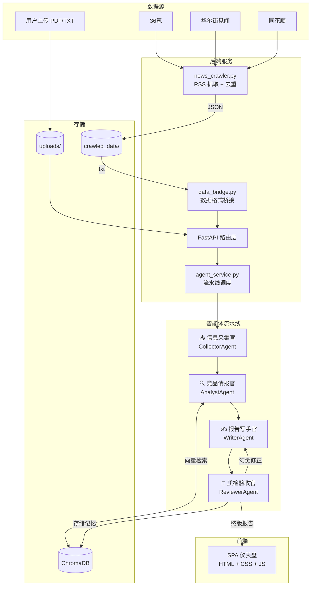

# 📊 AI 市场调研报告生成系统

> **Multi-Agent Market Research Report Generator**
>
> 基于多智能体协作的自动化市场调研报告生成系统


---

## 📖 项目简介

本系统通过 **4 个 AI 智能体** 协同工作，结合 **RSS 新闻自动采集** 与 **ChromaDB 长期记忆**，实现从数据采集到报告生成的全自动化流程。用户只需上传资料或开启自动采集，系统即可产出带数据溯源、经过幻觉检测的专业市场分析报告。

**核心理念：流水线 + 质检闭环**

```
用户上传文件 / RSS 自动采集
        │
        ▼
  ┌─────────────┐
  │ A · 信息采集官 │  解析文档 → 提取实体 → 结构化 JSON
  └─────────────┘
         │
  ┌─────────────┐
  │ B · 竞品情报官 │  查询 ChromaDB → 对比历史 → 计算趋势
  └─────────────┘
         │
  ┌─────────────┐
  │ C · 报告写手官 │  5 章节结构 → 生成 Markdown 初稿
  └─────────────┘
         │
  ┌─────────────┐     ┌─────────────┐
  │ D · 质检验收官 │───▶│ 数字校验工具   │
  └─────────────┘     └─────────────┘
         │ (幻觉 → 返回写手官修正，最多 2 轮)
         ▼
   终版报告 + 数据溯源附件
```

---

## 🎯 核心功能

| 功能 | 说明 |
|------|------|
| 📡 **多源 RSS 自动采集** | 定时抓取 36氪、华尔街见闻、同花顺等 RSS 源，自动去重，按日存储 |
| 🤖 **4 智能体流水线** | 采集官 → 情报官 → 写手官 → 质检验收官，全链路自动化 |
| 🧠 **ChromaDB 长期记忆** | 跨会话存储历史报告，向量检索增强分析深度 |
| 🔍 **幻觉检测与修正** | 质检验收官自动校验报告中每个数字，标记未找到来源的数据 |
| 📊 **可视化仪表盘** | 今日要闻 TOP5、7 日采集趋势图、质检通过率等指标卡片 |
| 📁 **报告管理** | 历史报告列表、Markdown 实时预览、数据溯源折叠面板 |
| ⏰ **定时任务调度** | APScheduler 每天 08:00 自动抓取，启动时立即执行一次 |
| 🔄 **熔断机制** | RSS 源连续失败 3 次自动跳过，避免阻塞整个流程 |

---

## 🏗️ 系统架构



---

## 🛠️ 技术栈

| 层级 | 技术 | 用途 |
|------|------|------|
| **后端框架** | FastAPI + Uvicorn | REST API 服务 |
| **AI 模型** | DeepSeek API（兼容 OpenAI SDK） | 实体提取、趋势分析、报告生成 |
| **向量数据库** | ChromaDB + onnxruntime | 长期记忆、语义检索 |
| **RSS 抓取** | feedparser | 新闻/研报自动采集 |
| **定时调度** | APScheduler | 每日定时抓取任务 |
| **PDF 解析** | pypdf | 上传文件文本提取 |
| **前端** | HTML + CSS + JavaScript | 原生 SPA，无框架依赖 |
| **图表** | Chart.js | 趋势折线图 |
| **Markdown** | marked.js | 报告实时渲染 |

---

## 🚀 快速启动

### 1. 克隆项目

```bash
git clone <your-repo-url>
cd market_research_agent
```

### 2. 安装依赖

```bash
pip install -r requirements.txt
```

### 3. 配置环境变量

在项目根目录创建 `.env` 文件：

```env
DEEPSEEK_API_KEY=sk-your-api-key-here
DEEPSEEK_BASE_URL=https://api.deepseek.com
DEEPSEEK_MODEL=deepseek-chat
```

### 4. 启动服务

```bash
uvicorn backend.main:app --reload --host 0.0.0.0 --port 8000
```

### 5. 访问系统

打开浏览器访问：**http://localhost:8000**

> 💡 启动后系统会自动执行一次 RSS 新闻抓取，并注册每天 08:00 的定时任务。

---

## 📂 项目结构

```
market_research_agent/
│
├── backend/                        # 后端服务
│   ├── main.py                     # FastAPI 入口 + 生命周期管理
│   ├── api/
│   │   ├── routes.py               # RESTful 路由定义
│   │   └── models.py               # Pydantic 数据模型
│   └── services/
│       ├── agent_service.py        # 智能体流水线调度
│       ├── memory_service.py       # ChromaDB 记忆服务
│       ├── news_crawler.py         # RSS 抓取（去重 + 熔断）
│       └── data_bridge.py          # 原始数据 → 智能体格式桥接
│
├── frontend/                       # 前端 SPA
│   ├── index.html                  # 主页面（含内联 SVG favicon）
│   ├── css/
│   │   └── style.css               # 全局样式（主色调 #4A6CF7）
│   └── js/
│       ├── app.js                  # 路由切换 + API 调用 + 渲染
│       └── dashboard.js            # 仪表盘图表 + 面板渲染
│
├── agents/                         # 智能体实现
│   ├── collector.py                # 信息采集官
│   ├── analyst.py                  # 竞品情报官
│   ├── writer.py                   # 报告写手官
│   ├── reviewer.py                 # 质检验收官
│   └── llm_client.py              # LLM API 调用封装
│
├── tools/                          # 工具函数
│   ├── file_parser.py              # PDF/TXT 文档解析
│   ├── memory_tools.py             # ChromaDB 存取工具
│   └── validation_tools.py         # 数字校验工具
│
├── crawled_data/                   # 爬虫数据（自动生成）
│   ├── YYYY-MM-DD.json             # 当日原始文章
│   ├── YYYY-MM-DD.txt              # 转换后的智能体调用格式
│   └── seen_hashes.json            # 去重哈希记录
│
├── memory_db/                      # ChromaDB 持久化目录
├── uploads/                        # 用户上传文件
├── mock_data/                      # 演示用数据
│   ├── 2024_smartphone_market.txt
│   ├── 2025_ev_trends.txt
│   └── brand_feedback.txt
│
├── app.py                          # Streamlit 旧版入口（保留）
├── API.md                          # API 接口文档
├── requirements.txt                # Python 依赖清单
├── .env                            # 环境变量（不提交到 Git）
└── README.md                       # 本文件
```

---

## 📡 API 接口

### 文件与报告

| 方法 | 路径 | 说明 |
|------|------|------|
| `POST` | `/api/upload` | 上传文件（TXT/PDF），返回 `file_id` |
| `POST` | `/api/generate` | 触发报告生成（支持 `use_crawled_data` 参数） |
| `GET` | `/api/status` | 查询流水线执行状态（前端每 5 秒轮询） |
| `GET` | `/api/reports` | 获取所有报告摘要列表 |
| `GET` | `/api/report/{id}` | 获取报告详情（Markdown + 来源） |
| `GET` | `/api/trace/{id}` | 获取数据溯源附件 |

### 仪表盘

| 方法 | 路径 | 说明 |
|------|------|------|
| `GET` | `/api/stats` | 统计指标（今日采集、报告数、质检率等） |
| `GET` | `/api/trend` | 近 7 日采集量与研报产出趋势 |
| `GET` | `/api/news/top5` | 今日要闻 TOP5（从爬取数据读取） |

### 爬虫

| 方法 | 路径 | 说明 |
|------|------|------|
| `POST` | `/api/crawl` | 手动触发一次新闻爬取 |
| `GET` | `/api/crawl/status` | 查看最近一次爬取状态 |

### 其他

| 方法 | 路径 | 说明 |
|------|------|------|
| `GET` | `/` | 前端 SPA 主页面 |
| `GET` | `/health` | 健康检查 |

---

## 🖥️ 效果预览

### 工作台仪表盘

```
┌─────────────────────────────────────────────────────────────┐
│  📥 今日采集   📄 累计报告   ✅ 质检通过率   ⚙️ 处理片段  │
│     98 篇         3 份         93.3%          156 条       │
├─────────────────────────────────────────────────────────────┤
│  📈 近 7 日采集与产出趋势                                 │
│  ┌───────────────────────────────────────────────┐         │
│  │  ╱╲    采集量 ───  研报产出 ───               │         │
│  │╱    ╲        ╱╲                              │         │
│  │      ╲──────  ╲──────                        │         │
│  └───────────────────────────────────────────────┘         │
├─────────────────────────────────────────────────────────────┤
│ 📰 今日要闻 TOP5       │ 📊 最新研报                    │
│ 1. 标题...    36氪     │ 📊 市场调研报告 2026-06-21      │
│ 2. 标题...    华尔街   │   已发布                        │
│ 3. 标题...    同花顺   │ 📊 智能手机分析 2026-06-20      │
│ 4. 标题...    36氪     │   已发布                        │
│ 5. 标题...    华尔街   │                                │
└────────────────────────┴─────────────────────────────────────┘
```

### 工作流通道

```
   ┌───┐      ┌───┐      ┌───┐      ┌───┐
   │ A │ ───▶ │ B │ ───▶ │ C │ ───▶ │ D │
   └───┘      └───┘      └───┘      └───┘
  采集官     情报官      写手官     质检官
   ✓ done    ✓ done    ✓ done    ✓ done

  ████████████████████████████████████ 100%

  [10:42:11] 📥 智能体A: 信息采集官 开始工作
  [10:42:15] ✅ 采集完成: 156 个文档片段
  [10:42:20] 🔍 智能体B: 竞品情报官 开始工作
  [10:42:25] ✅ 情报分析完成: 趋势数据已生成
  [10:43:01] ✍️ 智能体C: 报告写手官 开始工作
  [10:43:30] ✅ 报告初稿生成完成
  [10:43:35] 🔎 智能体D: 质检验收官 开始工作
  [10:43:45] ✅ 质检完成: 通过率 93.3%
  [10:43:46] 🎉 报告生成完毕！
```

---

## 🔧 配置说明

### RSS 源配置

在 `backend/services/news_crawler.py` 中修改 `RSS_SOURCES` 列表：

```python
RSS_SOURCES = [
    {"name": "36氪",     "url": "https://36kr.com/feed", "category": "科技创投"},
    {"name": "华尔街见闻", "url": "https://rsshub.rssforever.com/wallstreetcn/news/global", "category": "财经要闻"},
    {"name": "同花顺",    "url": "https://rsshub.rssforever.com/10jqka/realtimenews", "category": "实时行情"},
]
```

> 💡 部分源通过 [RSSHub](https://github.com/DIYgod/RSSHub) 代理，可自行搭建私有实例以提高稳定性。

### 定时任务

在 `backend/main.py` 中修改抓取时间：

```python
# 每天早上 8:00 自动抓取
scheduler.add_job(crawl_all, trigger=CronTrigger(hour=8, minute=0), ...)
```

### 智能体提示词

各智能体的系统提示词位于 `agents/` 目录下对应的 `.py` 文件中的 `SYSTEM_PROMPT` 常量。

---

## 🗺️ 后续规划

- [ ] 报告导出为 PDF 格式
- [ ] 用户认证与多用户支持
- [ ] 更多 RSS 源接入（财新、东方财富等）
- [ ] 报告模板自定义（行业模板库）
- [ ] Docker 容器化部署
- [ ] 实时 WebSocket 推送（替代轮询）
- [ ] 多语言支持（英文报告生成）

---

## 📄 许可证

本项目基于 [MIT License](LICENSE) 开源。

---

<p align="center">
  Built with ❤️ by Multi-Agent Team
</p>
